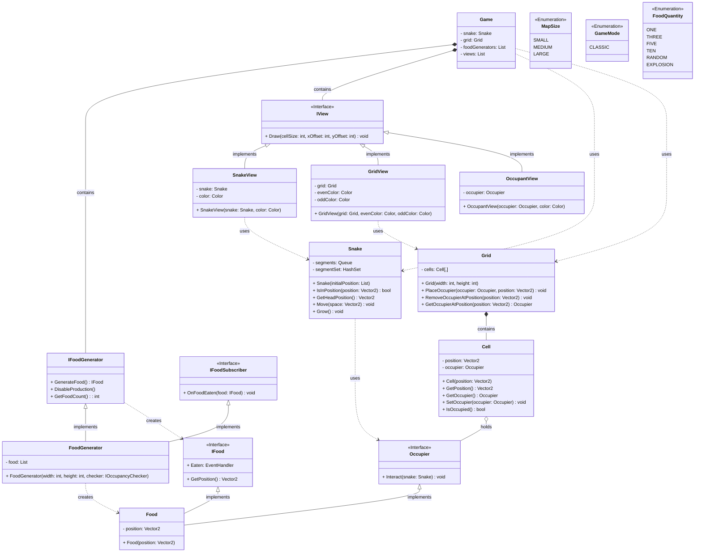

# Snake_RayLib_CS
The classic game SNAKE made using C# and the RayLib library
 
## Snake Class Diagram (Mermaid)

```mermaid
classDiagram
    IFoodGenerator <|-- FoodGenerator : implements
    IFood <|-- Food : implements
    Occupier <|-- Food : implements
    IView <|-- SnakeView : implements
    IView <|-- GridView : implements
    IView <|-- OccupantView : implements
    IFoodSubscriber <|-- FoodGenerator : implements

    Grid *-- Cell : contains
    Game *-- IFoodGenerator : contains
    Game *-- IView : contains

    Cell o-- Occupier : holds

    Snake ..> Occupier : uses
    GridView ..> Grid : uses
    SnakeView ..> Snake : uses
    FoodGenerator ..> Food : creates
    IFoodGenerator ..> IFood : creates
    Game ..> Snake : uses
    Game ..> Grid : uses

	class Snake {
		- segments: Queue<Vector2>
        - segmentSet: HashSet<Vector2>
        + Snake(initialPosition: List<Vector2>)
        + IsInPosition(position: Vector2) bool
        + GetHeadPosition() Vector2
        + Move(space: Vector2) void
        + Grow() void
	}

    class Occupier {
        <<Interface>>
        + Interact(snake: Snake) void
    }

    class IFood {
        <<Interface>>
        + Eaten: EventHandler<IFood>
        + GetPosition() Vector2
    }

    class Food {
        - position: Vector2
        + Food(position: Vector2)
    }

    class IFoodGenerator {
        + GenerateFood() IFood
        + DisableProduction()
        + GetFoodCount(): int
    }

    class FoodGenerator {
        - food: List<Food>
        + FoodGenerator(width: int, height: int, checker: IOccupancyChecker)
    }

    class Cell {
        - position: Vector2
        - occupier: Occupier
        + Cell(position: Vector2)
        + GetPosition() Vector2
        + GetOccupier() Occupier
        + SetOccupier(occupier: Occupier) void
        + IsOccupied() bool
    }

    class Grid {
        - cells: Cell[,]
        + Grid(width: int, height: int)
        + PlaceOccupier(occupier: Occupier, position: Vector2) void
        + RemoveOccupierAtPosition(position: Vector2) void
        + GetOccupierAtPosition(position: Vector2) Occupier
    }

    class IView {
        <<Interface>>
        + Draw(cellSize: int, xOffset: int, yOffset: int) void
    }

    class SnakeView {
        - snake: Snake
        - color: Color
        + SnakeView(snake: Snake, color: Color)
    }

    class GridView {
        - grid: Grid
        - evenColor: Color
        - oddColor: Color
        + GridView(grid: Grid, evenColor: Color, oddColor: Color)
    }

    class OccupantView {
        - occupier: Occupier
        + OccupantView(occupier: Occupier, color: Color)
    }

    class IFoodSubscriber {
        <<Interface>>
        + OnFoodEaten(food: IFood) void
    }

    class Game {
        - snake: Snake
        - grid: Grid
        - foodGenerators: List<FoodGenerator>
        - views: List<IView>

    }

    class MapSize {
        <<Enumeration>>
        SMALL
        MEDIUM
        LARGE
    }

    class GameMode {
        <<Enumeration>>
        CLASSIC
    }

    class FoodQuantity {
        <<Enumeration>>
        ONE
        THREE
        FIVE
        TEN
        RANDOM
        EXPLOSION
    }
```
